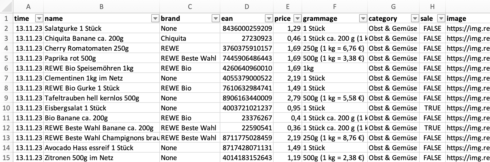

# rewe-price-data

This is a daily updating repository containing all items from the German supermarket chain REWE with name, brand, EAN, price, grammage, category, discount status, and image as CSV.

Currently two CSVs are generated per day. One CSV for a REWE market in Schleswig-Holstein (Northern Germany) and one for a market in Bavaria (Southern Germany).

#### Sample Data

